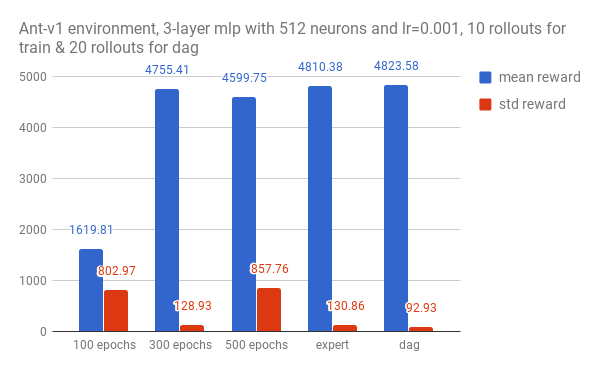
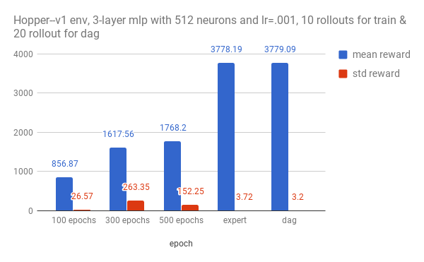

# CS294-112 HW 1: Imitation Learning

Dependencies: TensorFlow, MuJoCo version 1.31, OpenAI Gym

The only file that you need to look at is `run_expert.py`, which is code to load up an expert policy, run a specified number of roll-outs, and save out data.

In `experts/`, the provided expert policies are:
* Ant-v1.pkl
* HalfCheetah-v1.pkl
* Hopper-v1.pkl
* Humanoid-v1.pkl
* Reacher-v1.pkl
* Walker2d-v1.pkl

The name of the pickle file corresponds to the name of the gym environment.

# Notes
to get better results:
- use more rollouts & more epochs
- DAG

# Results

  

  

from which we can see:
- Hopper-v1 is more difficult to train by behavioral cloning than Ant-v1.
- DAgger helps Hopper-v1 agent achieves comparable results to the expert.
